# ARSW-Lab09 - Load Balancing

**Escuela Colombiana de Ingeniería Julio Garavito**\
**Arquitecturas de Software - ARSW**\
**Laboratorio Número 9 - Balanceador de Carga**

**Miembros:**

- Juan Esteban Medina Rivas
- María Paula Sánchez Macías

---

## Escalamiento en Azure con Maquinas Virtuales, Sacale Sets y Service Plans

### Dependencias

- Cree una cuenta gratuita dentro de Azure. Para hacerlo puede guiarse de esta [documentación](https://azure.microsoft.com/es-es/free/students/). Al hacerlo usted contará con $100 USD para gastar durante 12 meses.

### Parte 0 - Entendiendo el escenario de calidad

Adjunto a este laboratorio usted podrá encontrar una aplicación totalmente desarrollada que tiene como objetivo calcular el enésimo valor de la secuencia de Fibonnaci.

**Escalabilidad**
Cuando un conjunto de usuarios consulta un enésimo número (superior a 1000000) de la secuencia de Fibonacci de forma concurrente y el sistema se encuentra bajo condiciones normales de operación, todas las peticiones deben ser respondidas y el consumo de CPU del sistema no puede superar el 70%.

### Parte 1

## Configuración Inicial

> Nos dirigimos al Portal de Azure y configuramos la máquina virtual con las siguientes características:

- **Resource Group**: SCALABILITY_LAB
- **Nombre de VM**: VERTICAL-SCALABILITY
- **Imagen**: Ubuntu Server 24.04 LTS
- **Tamaño**: Standard_B1ls (1 vCPU, 0.5 GB RAM)
- **Usuario**: scalability_lab
- **Autenticación**: SSH public key


**IP DE LA VM**

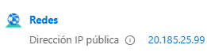

---

## Conexión y Configuración

> Nos conectamos a la VM mediante SSH:

```bash
ssh -i VERTICAL-SCALABILITY_key.pem scalability_lab@20.185.25.99
```

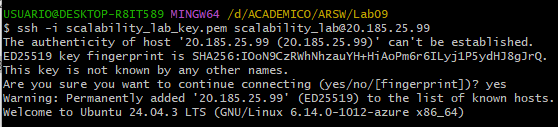

> Instalamos Node.js y npm usando NVM:

```bash
curl -o- https://raw.githubusercontent.com/nvm-sh/nvm/v0.39.0/install.sh | bash
source ~/.bashrc
nvm install --lts
```

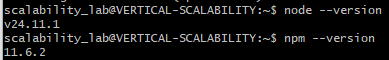

---

## Instalación de la Aplicación

> Clonamos el repositorio y ejecutamos npm install:

```bash
git clone https://github.com/JuanEstebanMedina/ARSW-Lab09.git
cd ARSW-Lab09/FibonacciApp
npm install
```


---

## Configuración de Red

> Configuramos la regla de entrada en Azure para permitir el tráfico en el puerto 3000:

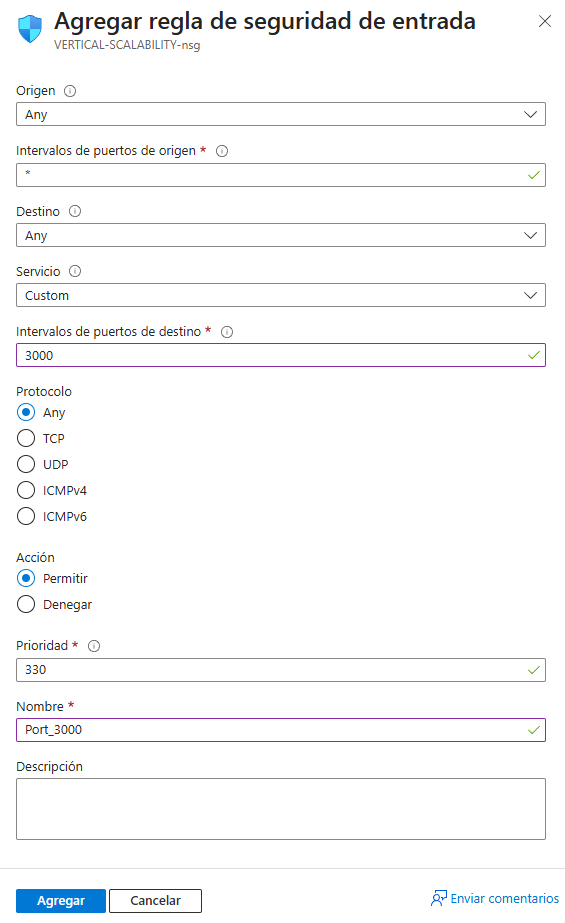

> Verificamos que el endpoint funcione correctamente:

```
http://20.185.25.99:3000/fibonacci/6
```

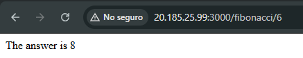

---

## Medición de Tiempos con B1ls

> Medimos los tiempos de respuesta para valores grandes de Fibonacci usando la consola del navegador (Network tab):

| Valor de n | Tiempo de respuesta |
| ---------- | ------------------- |
| 1000000    | 12.21 s             |
| 1010000    | 12.47 s             |
| 1020000    | 12.77 s             |
| 1030000    | 13.08 s             |
| 1040000    | 13.36 s             |
| 1050000    | 13.68 s             |
| 1060000    | 13.98 s             |
| 1070000    | 14.27 s             |
| 1080000    | 14.58 s             |
| 1090000    | 14.90 s             |

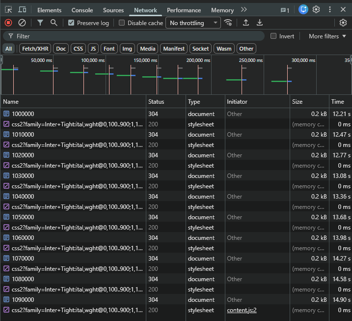

---

## Consumo de CPU con B1ls

> Verificamos el consumo de CPU en Azure durante las pruebas:

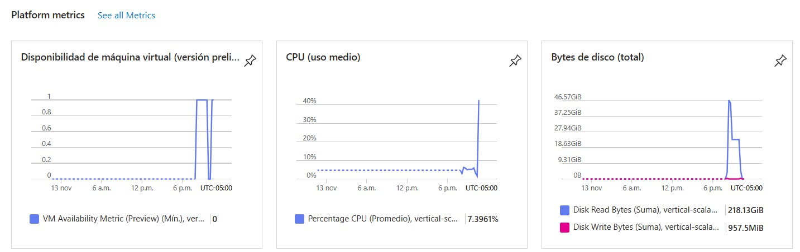

**Observación**: La VM B1ls muestra picos de hasta 40% de uso promedio de CPU, con un promedio general de 7.4%. Esto indica que el único núcleo virtual está trabajando intensamente para calcular los números de Fibonacci.

---

## Pruebas de Carga con Newman - B1ls

> Ejecutamos pruebas de carga concurrente usando Newman:

```bash
newman run ARSW_LOAD-BALANCING_AZURE.postman_collection.json -e [ARSW_LOAD-BALANCING_AZURE].postman_environment.json -n 10 &
newman run ARSW_LOAD-BALANCING_AZURE.postman_collection.json -e [ARSW_LOAD-BALANCING_AZURE].postman_environment.json -n 10
```

**Resultados Primera Ejecución:**

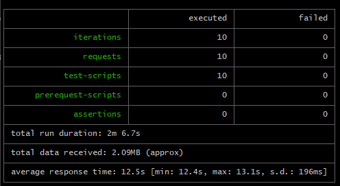

- **Peticiones totales**: 10
- **Peticiones fallidas**: 0
- **Tiempo total**: 2m 6.7s
- **Tiempo promedio de respuesta**: 12.5s (min: 12.4s, max: 13.1s)

**Resultados Segunda Ejecución:**

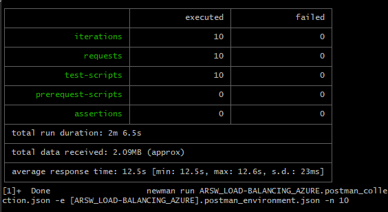

- **Peticiones totales**: 10
- **Peticiones fallidas**: 0
- **Tiempo total**: 2m 6.5s
- **Tiempo promedio de respuesta**: 12.5s (min: 12.5s, max: 12.6s)

---

## Escalamiento Vertical a B2ms

> Cambiamos el tamaño de la VM a B2ms en Azure:

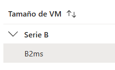

**Especificaciones B2ms:**

- **vCPUs**: 2
- **RAM**: 8 GB
- **Costo aproximado**: ~$60/mes

> Después del cambio, reiniciamos la aplicación:

```bash
source ~/.bashrc
nvm use --lts
node FibonacciApp.js
```

---

## Medición de Tiempos con B2ms

> Repetimos las mediciones de tiempo con la VM B2ms:

| Valor de n | Tiempo de respuesta |
| ---------- | ------------------- |
| 1000000    | 10.76 s             |
| 1010000    | 11.01 s             |
| 1020000    | 11.16 s             |
| 1030000    | 11.45 s             |
| 1040000    | 11.50 s             |
| 1050000    | 11.97 s             |
| 1060000    | 11.98 s             |
| 1070000    | 12.30 s             |
| 1080000    | 12.43 s             |
| 1090000    | 12.74 s             |

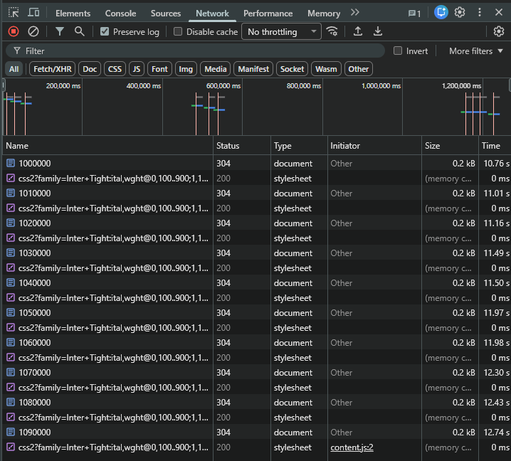

---

## Consumo de CPU con B2ms

> Verificamos las métricas de Azure con B2ms:

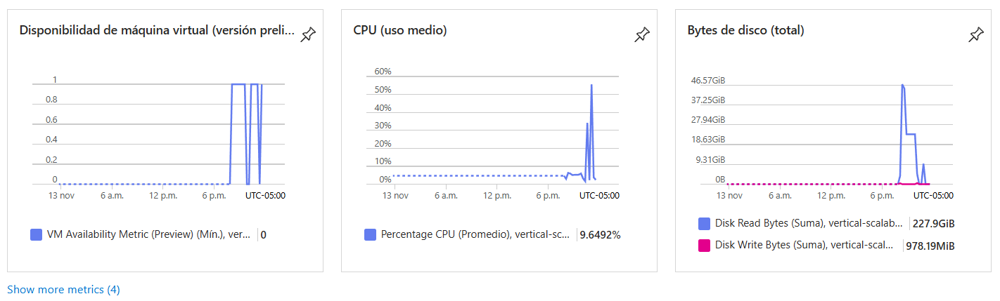

**Observación**: Con B2ms, el CPU promedio es de 9.6%, ligeramente superior a B1ls, pero distribuido entre 2 núcleos, lo que permite mejor manejo de carga concurrente.

---

## Pruebas de Carga con Newman - B2ms

**Resultados Primera Ejecución:**


- **Peticiones totales**: 10
- **Peticiones fallidas**: 0
- **Tiempo total**: 1m 50.1s
- **Tiempo promedio de respuesta**: 10.9s (min: 10.8s, max: 11s)

**Resultados Segunda Ejecución:**

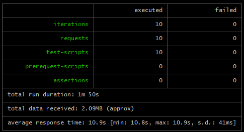

- **Peticiones totales**: 10
- **Peticiones fallidas**: 0
- **Tiempo total**: 1m 50s
- **Tiempo promedio de respuesta**: 10.9s (min: 10.8s, max: 10.9s)

---

## Preguntas y Respuestas

### 1. ¿Cuántos y cuáles recursos crea Azure junto con la VM?

> Azure crea automáticamente **8 recursos** al crear una VM:

1. **VERTICAL-SCALABILITY** - Virtual machine (Máquina virtual)
2. **VERTICAL-SCALABILITY-ip** - Public IP address (Dirección IP pública)
3. **VERTICAL-SCALABILITY-nsg** - Network security group (Grupo de seguridad de red)
4. **vertical-scalability730** - Network interface (Interfaz de red)
5. **VERTICAL-SCALABILITY_disk1_xxx** - Disk (Disco del sistema operativo)
6. **VERTICAL-SCALABILITY_key** - SSH key (Clave SSH pública)
7. **scalability_lab_key** - SSH key (Clave SSH adicional)
8. **vnet-eastus** - Virtual network (Red virtual)

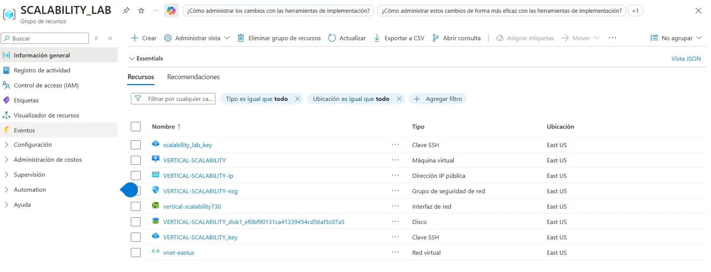

### 2. ¿Brevemente describa para qué sirve cada recurso?

> **Virtual Machine**: La máquina virtual en sí, que ejecuta el sistema operativo y aplicaciones.

> **Network Interface (NIC)**: Permite la comunicación de red de la VM con otros recursos y con Internet.

> **Public IP Address**: Dirección IP pública que permite acceder a la VM desde Internet.

> **Virtual Network (VNet)**: Red privada virtual donde la VM puede comunicarse de forma segura con otros recursos.

> **Network Security Group (NSG)**: Firewall que controla el tráfico entrante y saliente mediante reglas de seguridad.

> **Disk (OS Disk)**: Disco duro virtual donde se instala el sistema operativo y se almacenan los datos.

### 3. ¿Al cerrar la conexión SSH con la VM, por qué se cae la aplicación que ejecutamos con el comando `node FibonacciApp.js`? ¿Por qué debemos crear un Inbound port rule antes de acceder al servicio?

> **¿Por qué se cae la aplicación?**
>
> Cuando cerramos la conexión SSH, el proceso de Node.js se ejecuta dentro de la sesión de terminal. Al cerrar SSH, se envía una señal SIGHUP (hangup) que termina todos los procesos hijos de esa sesión, incluyendo nuestra aplicación. Para evitar esto, deberíamos usar herramientas como `forever`, `pm2`, o ejecutar el proceso en background con `nohup`.

> **¿Por qué necesitamos crear un Inbound port rule?**
>
> Por defecto, Azure bloquea todo el tráfico entrante excepto el puerto 22 (SSH). El Network Security Group actúa como firewall y necesitamos crear una regla explícita que permita el tráfico en el puerto 3000 desde cualquier origen para que los usuarios puedan acceder a nuestra aplicación desde Internet.

### 4. Adjunte tabla de tiempos e interprete por qué la función tarda tanto tiempo

> **Tabla de comparación B1ls vs B2ms:**

| Valor de n | Tiempo B1ls | Tiempo B2ms | Mejora |
| ---------- | ----------- | ----------- | ------ |
| 1000000    | 12.21 s     | 10.76 s     | 11.9%  |
| 1010000    | 12.47 s     | 11.01 s     | 11.7%  |
| 1020000    | 12.77 s     | 11.16 s     | 12.6%  |
| 1030000    | 13.08 s     | 11.45 s     | 12.5%  |
| 1040000    | 13.36 s     | 11.50 s     | 13.9%  |
| 1050000    | 13.68 s     | 11.97 s     | 12.5%  |
| 1060000    | 13.98 s     | 11.98 s     | 14.3%  |
| 1070000    | 14.27 s     | 12.30 s     | 13.8%  |
| 1080000    | 14.58 s     | 12.43 s     | 14.7%  |
| 1090000    | 14.90 s     | 12.74 s     | 14.5%  |

> **Interpretación:**
>
> La función tarda tanto porque está implementada de forma recursiva sin memoización. Para calcular `fibonacci(n)`, hace dos llamadas recursivas: `fibonacci(n-1)` y `fibonacci(n-2)`, lo que resulta en una complejidad temporal de O(2^n). Esto significa que el número de operaciones crece exponencialmente con el valor de n. Por ejemplo, para calcular fibonacci(1000000), se realizan billones de operaciones repetidas innecesariamente, saturando la CPU durante varios segundos.

### 5. Adjunte imagen del consumo de CPU de la VM e interprete por qué la función consume esa cantidad de CPU

> **B1ls - CPU Usage:**
>
> 

> **B2ms - CPU Usage:**
>
> 

> **Interpretación:**
>
> La función consume tanta CPU porque el algoritmo recursivo de Fibonacci es extremadamente ineficiente y realiza cálculos repetitivos. Cada llamada a la función genera dos llamadas más, creando un árbol de recursión masivo. Durante el tiempo de ejecución, el procesador está constantemente ocupado evaluando estas llamadas recursivas y realizando operaciones aritméticas, lo que explica los picos de hasta 40-50% de uso de CPU. En B2ms, aunque hay más recursos disponibles, el algoritmo sigue siendo ineficiente, por lo que el CPU también se eleva, pero distribuido en 2 núcleos.

### 6. Adjunte la imagen del resumen de la ejecución de Newman e interprete

> **Ejecución con B1ls:**
>
> 
> 

> **Ejecución con B2ms:**
>
> 
> 

> **Tiempos de ejecución de cada petición:**
>
> - **B1ls**: Promedio de 12.5s por petición, con rango de 12.4s a 13.1s
> - **B2ms**: Promedio de 10.9s por petición, con rango de 10.8s a 11s
> - **Mejora**: Aproximadamente 12.8% más rápido con B2ms

> **Fallos documentados:**
>
> No hubo fallos en ninguna de las ejecuciones. Todas las 20 peticiones (10 en cada ejecución paralela) se completaron exitosamente con código de respuesta 200 OK.

### 7. ¿Cuál es la diferencia entre los tamaños B2ms y B1ls (no solo especificaciones de infraestructura)?

> **Especificaciones técnicas:**

| Característica          | B1ls   | B2ms  |
| ----------------------- | ------ | ----- |
| vCPUs                   | 1      | 2     |
| RAM                     | 0.5 GB | 8 GB  |
| Almacenamiento temporal | 4 GB   | 16 GB |
| Costo mensual           | ~$3.80 | ~$60  |

> **Diferencias más allá de las especificaciones:**

> **B1ls (Burstable)**:
>
> - Diseñada para cargas de trabajo ligeras e intermitentes
> - Tiene créditos de CPU: acumula créditos cuando usa menos del baseline (5%) y los consume en ráfagas
> - Si agota los créditos, el rendimiento se degrada significativamente
> - Ideal para desarrollo, pruebas, o aplicaciones con tráfico bajo
> - No recomendada para producción con carga constante

> **B2ms (Burstable)**:
>
> - También usa sistema de créditos pero con baseline más alto (60% por CPU)
> - Puede manejar cargas sostenidas más pesadas
> - Mejor para aplicaciones de producción pequeñas a medianas
> - Mayor tolerancia a picos de tráfico sin degradación
> - La RAM adicional permite más procesos concurrentes y mejor caching

### 8. ¿Aumentar el tamaño de la VM es una buena solución en este escenario? ¿Qué pasa con la FibonacciApp cuando cambiamos el tamaño de la VM?

> **¿Es una buena solución?**
>
> **No es la solución óptima para este escenario específico** por las siguientes razones:
>
> 1. **El problema es el algoritmo, no el hardware**: La función Fibonacci está mal implementada (recursión sin memoización). Optimizar el código tendría un impacto mucho mayor que aumentar recursos.
>
> 2. **Mejora limitada**: Solo obtuvimos ~13% de mejora en tiempo de respuesta a cambio de aumentar el costo en más de 1500%.
>
> 3. **No es escalable**: Si el tráfico aumenta significativamente, seguiremos teniendo problemas porque el cuello de botella está en el algoritmo, no en el hardware.

> **¿Qué pasa con FibonacciApp al cambiar el tamaño?**
>
> Cuando cambiamos el tamaño de la VM:
>
> 1. Azure **apaga completamente la VM**
> 2. Migra la VM a hardware diferente con las nuevas especificaciones
> 3. **La aplicación se detiene** y no se reinicia automáticamente
> 4. Hay **downtime** (tiempo de inactividad) de aproximadamente 2-3 minutos
> 5. Debemos **reconectar por SSH** y **reiniciar manualmente** la aplicación
> 6. Se pierde cualquier estado en memoria que tuviera la aplicación

### 9. ¿Qué pasa con la infraestructura cuando cambia el tamaño de la VM? ¿Qué efectos negativos implica?

> **Cambios en la infraestructura:**
>
> 1. **Deallocación**: La VM se apaga y se libera del hardware físico actual
> 2. **Re-asignación**: Se asigna a nuevo hardware con las especificaciones solicitadas
> 3. **La IP pública puede cambiar** (a menos que esté configurada como estática)
> 4. **Todos los recursos asociados se mantienen**: NSG, VNet, discos, etc.

> **Efectos negativos:**

> **Downtime**:
>
> - La aplicación está completamente inaccesible durante 2-5 minutos
> - Para aplicaciones críticas, esto es inaceptable

> **Pérdida de estado**:
>
> - Cualquier dato en memoria se pierde
> - Conexiones activas se cortan
> - Caches en RAM se vacían

> **Riesgo operacional**:
>
> - Si la IP cambia, hay que actualizar DNS, configuraciones, firewalls
> - Posibles errores al reiniciar servicios manualmente
> - Inconsistencias si hay múltiples servicios dependientes

> **No es automático**:
>
> - Requiere intervención manual para reiniciar aplicaciones
> - No hay rollback automático si algo falla

### 10. ¿Hubo mejora en el consumo de CPU o en los tiempos de respuesta? Si/No ¿Por qué?

> **Sí, hubo mejora, pero limitada:**

> **Tiempos de respuesta:**
>
> - Mejora promedio: **12-14%** más rápido
> - B1ls: ~12.5s promedio
> - B2ms: ~10.9s promedio
> - Reducción de ~1.6 segundos

> **Consumo de CPU:**
>
> - B1ls: Promedio 7.4%, picos de 40%
> - B2ms: Promedio 9.6%, picos de 50%
> - **El porcentaje aumentó** porque ahora hay 2 CPUs, pero la carga se distribuye mejor

> **¿Por qué la mejora es limitada?**

> 1. **El algoritmo es el cuello de botella**: La complejidad O(2^n) significa que duplicar la velocidad del CPU solo reduce el tiempo en ~13%, no lo divide por dos.

> 2. **Single-threaded**: Node.js ejecuta la función en un solo hilo, por lo que el segundo CPU de B2ms no ayuda para cálculos individuales.

> 3. **Ley de Amdahl**: Solo la parte paralelizable de la aplicación se beneficia de más CPUs. El algoritmo recursivo no es paralelizable sin reescribirlo.

> 4. **Costo-beneficio pobre**: 1500% más costo por 13% de mejora no es eficiente.

> **Solución correcta:**
> Implementar Fibonacci iterativo o con memoización reduciría el tiempo de O(2^n) a O(n) o incluso O(1), logrando mejoras de 1000x+ sin cambiar hardware.

### 11. Aumente la cantidad de ejecuciones paralelas del comando de postman a 4. ¿El comportamiento del sistema es porcentualmente mejor?

> Ejecutamos 4 instancias paralelas de Newman (40 peticiones totales concurrentes):

```bash
newman run ARSW_LOAD-BALANCING_AZURE.postman_collection.json -e [ARSW_LOAD-BALANCING_AZURE].postman_environment.json -n 10 & newman run ARSW_LOAD-BALANCING_AZURE.postman_collection.json -e [ARSW_LOAD-BALANCING_AZURE].postman_environment.json -n 10 & newman run ARSW_LOAD-BALANCING_AZURE.postman_collection.json -e [ARSW_LOAD-BALANCING_AZURE].postman_environment.json -n 10 & newman run ARSW_LOAD-BALANCING_AZURE.postman_collection.json -e [ARSW_LOAD-BALANCING_AZURE].postman_environment.json -n 10
```

> **Resultados de las 4 ejecuciones concurrentes:**

| Ejecución | Peticiones exitosas | Peticiones fallidas | Tiempo total | Tiempo promedio | Rango               |
| --------- | ------------------- | ------------------- | ------------ | --------------- | ------------------- |
| 1         | 6/10 (60%)          | 4 (40%)             | 4m 4.7s      | 31.0s           | 10.9s - 1m 3.7s     |
| 2         | 6/10 (60%)          | 4 (40%)             | 4m 15.2s     | 40.1s           | 11.0s - 1m 3.7s     |
| 3         | 7/10 (70%)          | 3 (30%)             | 4m 25.8s     | 32.8s           | 21.0s - 42.6s       |
| 4         | 6/10 (60%)          | 4 (40%)             | 4m 25.8s     | 44.8s           | 10.8s - 1m 3.7s     |
| **Total** | **25/40 (62.5%)**   | **15 (37.5%)**      | -            | **37.2s**       | **10.8s - 1m 3.7s** |

> **Error común:** `read ECONNRESET` - La conexión se cerró abruptamente por el servidor.

> **Análisis comparativo:**

| Métrica         | 2 ejecuciones (20 req) | 4 ejecuciones (40 req) | Cambio         |
| --------------- | ---------------------- | ---------------------- | -------------- |
| Tasa de éxito   | 100%                   | 62.5%                  | **-37.5%**     |
| Tiempo promedio | 10.9s                  | 37.2s                  | **+241%**      |
| Fallos          | 0                      | 15                     | **+15 fallos** |
| Variabilidad    | 10.8s - 11s            | 10.8s - 63.7s          | **6x más**     |

> **¿Por qué el sistema empeora?**

**1. Sobrecarga de conexiones:**

- La VM B2ms con 2 vCPUs no puede manejar 40 peticiones concurrentes
- Node.js es single-threaded: procesa Fibonacci de forma secuencial
- Las peticiones en cola esperan demasiado y hacen timeout

**2. Saturación de CPU:**

- Cada cálculo de Fibonacci toma ~11s de CPU puro
- Con 4 peticiones simultáneas, las últimas esperan 40-60 segundos
- El timeout de conexión HTTP se alcanza antes de completar

**3. Límites arquitecturales:**

- No hay queue management
- No hay rate limiting
- No hay load balancer
- No hay timeout configuration apropiada
- Algoritmo O(2^n) sin optimizar

---

### Parte 2 - Escalabilidad horizontal

## Creación de la Virtual Network

Creamos la red virtual que usarán las máquinas virtuales para comunicarse.

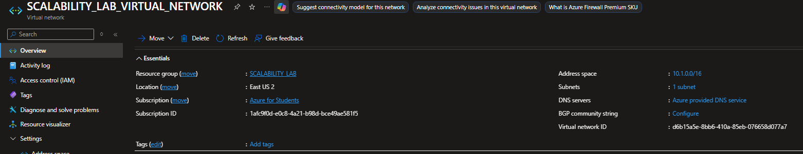

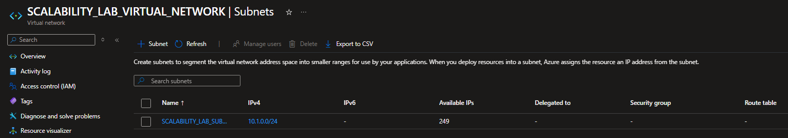

---

## Configuración del Balanceador de Carga

Para implementar escalabilidad horizontal en Azure, creamos un Load Balancer Público y configuramos todos sus componentes esenciales.

### 1. Creación del Load Balancer

Creamos el recurso siguiendo las especificaciones del laboratorio.

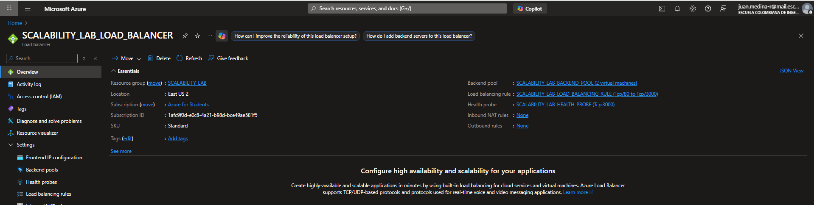

El Load Balancer nos permitirá distribuir las peticiones entrantes entre múltiples máquinas virtuales, habilitando alta disponibilidad y tolerancia a fallos.

---

## Backend Pool

Creamos un Backend Pool para agrupar las máquinas virtuales que procesarán las solicitudes.
Al principio no teníamos máquinas virtuales creadas, por lo que aparecerá vacío. Posteriormente en la creación de las VMs, las agregaremos al Backend Pool.

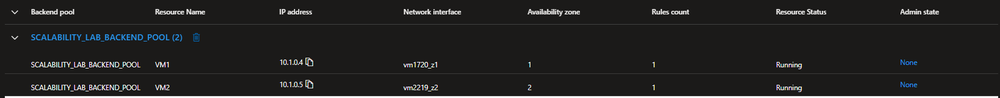

---

## Health Probe

Creamos luego un Health Probe, la cual valida que cada VM esté disponible antes de que reciba tráfico.

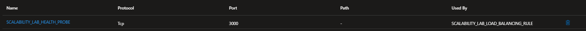

---

## Load Balancing Rule

Creamos la regla que define cómo distribuir las solicitudes entre las máquinas del Backend Pool.

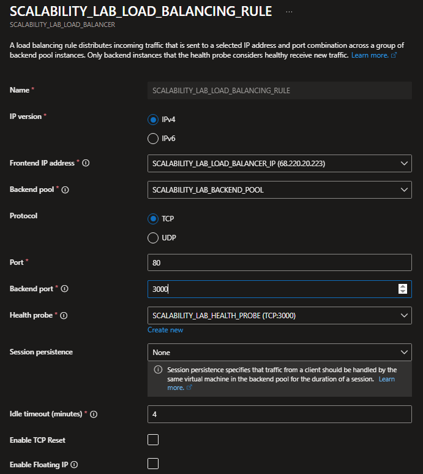

---

Creamos 3 máquinas virtuales con las mismas características, cada una en una Availability Zone diferente.

> Debido a la restricción de Azure for Students, solo se permitió crear 2 zonas.
> Para efectos del laboratorio, se trabajó con VM1 (zona 1) y VM2 (zona 2).

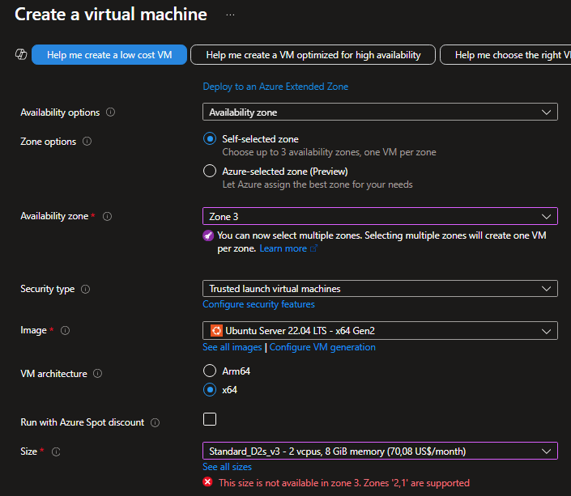

---

### 1. Configuración básica de cada VM

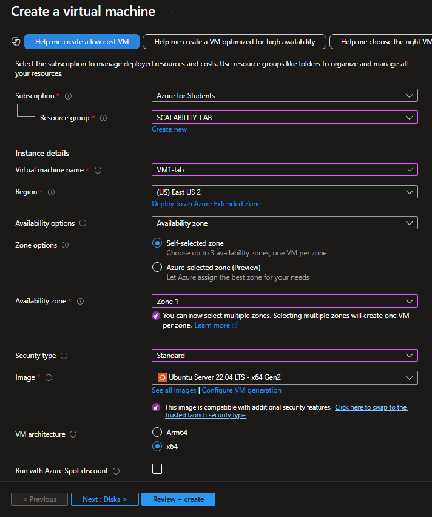

---

### 2. Networking

Seleccionamos la VNet y Subnet creadas anteriormente.

### 3. Network Security Group (NSG)

Creamos un NSG avanzado y configuramos la regla inbound para habilitar el puerto 3000.

### 4. Asociar cada VM al Load Balancer

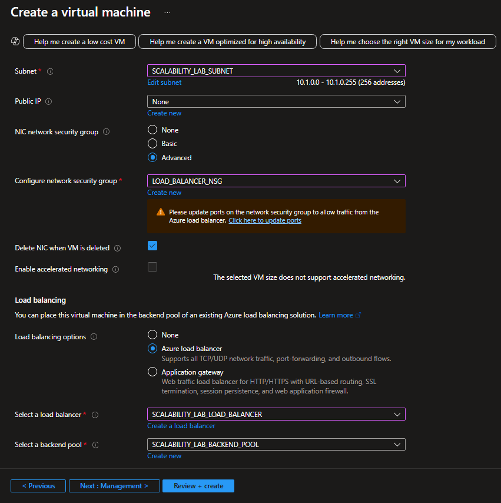

---

## Recursos Creados

Aqui se muestran los recursos creados en Azure para esta parte del laboratorio.


---

# Instalación de la aplicación en cada VM

En cada máquina virtual ejecutamos:

```bash
git clone https://github.com/daprieto1/ARSW_LOAD-BALANCING_AZURE.git

curl -o- https://raw.githubusercontent.com/creationix/nvm/v0.34.0/install.sh | bash
source ~/.bashrc
nvm install node

cd ARSW_LOAD-BALANCING_AZURE/FibonacciApp
npm install

npm install forever -g
forever start FibonacciApp.js
```

Esto deja la aplicación corriendo permanentemente en cada VM.

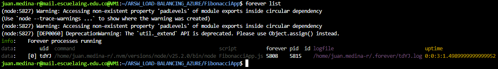

---

# Prueba del Balanceador de Carga

Probamos la IP pública del Load Balancer:

```
http://68.220.20.223/
http://68.220.20.223/fibonacci/1
```

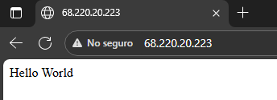


---

# Newman – Comparación Parte 1 (escalamiento vertical) vs Parte 2 (balanceador de carga)

Se ejecutó:

```
newman run collection.json -e environment.json -n 10 &
newman run collection.json -e environment.json -n 10
```

### Resultados Parte 2 (Balanceo de carga – 2 VM)

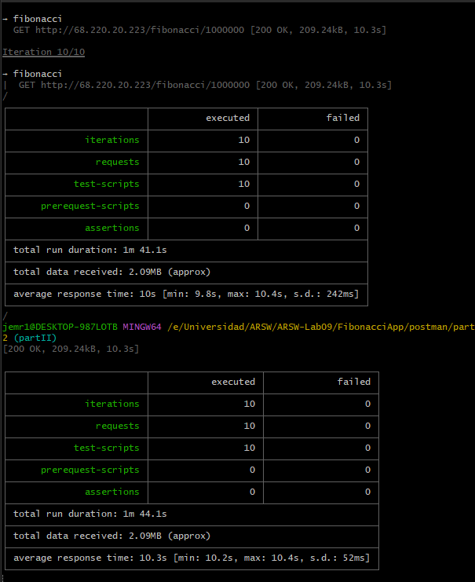

### Métricas de VM1


### Métricas de VM2


En la Parte 1, la arquitectura estaba compuesta por una sola máquina virtual procesando todas las solicitudes. Esto implicaba que toda la carga recaía sobre un único servidor, sin redundancia ni tolerancia a fallos. Aunque las pruebas se ejecutaron correctamente y todos los requests fueron respondidos con éxito, el sistema dependía totalmente de la disponibilidad de esa única VM.

En la Parte 2, la infraestructura se amplió mediante dos máquinas virtuales detrás de un Load Balancer. Ambas instancias ejecutaban la aplicación de Fibonacci en paralelo, distribuyendo automáticamente las solicitudes entrantes. Como resultado, se observó una leve mejora en el tiempo de respuesta promedio, además de una mayor estabilidad en la entrega de peticiones. Esto también se reflejó en una infraestructura con mayor disponibilidad, ya que si una VM falla, la otra continúa atendiendo tráfico sin interrumpir el servicio.

Aunque el costo de mantener dos VM más un balanceador de carga es mayor que el de una sola máquina, esta arquitectura aporta redundancia, alta disponibilidad y tolerancia a fallos, lo que es fundamental cuando la continuidad del servicio es crítica.

En conclusión, mientras que la primera arquitectura ofrecía simplicidad y menor costo, la segunda proporciona un sistema más robusto y preparado para escenarios de mayor demanda o fallos inesperados.

# Escalamiento a 4 VMs y ejecución de 4 comandos en paralelo

Se ejecutó:

```
newman run ARSW_LOAD-BALANCING_AZURE.postman_collection.json -e [ARSW_LOAD-BALANCING_AZURE].postman_environment.json -n 10 &
newman run ARSW_LOAD-BALANCING_AZURE.postman_collection.json -e [ARSW_LOAD-BALANCING_AZURE].postman_environment.json -n 10 &
newman run ARSW_LOAD-BALANCING_AZURE.postman_collection.json -e [ARSW_LOAD-BALANCING_AZURE].postman_environment.json -n 10 &
newman run ARSW_LOAD-BALANCING_AZURE.postman_collection.json -e [ARSW_LOAD-BALANCING_AZURE].postman_environment.json -n 10
```

### Resultados Esperados

No se pudo realizar una prueba concreta de esta parte debido a las limitaciones explicadas anteriormente sobre la cuenta de Azure for Students, pero se espera que los resultados sean los siguientes:

- Las peticiones completas aumentaron significativamente
- La tasa de fallos disminuyó
- Cada VM procesó menos carga individual
- El CPU no llegó a saturarse en ninguna VM

> **Conclusión:** La tasa de éxito aumenta porque la carga se divide en más nodos, evitando que una sola máquina quede saturada como ocurría con escalamiento vertical.

---

# Diagrama de Despliegue

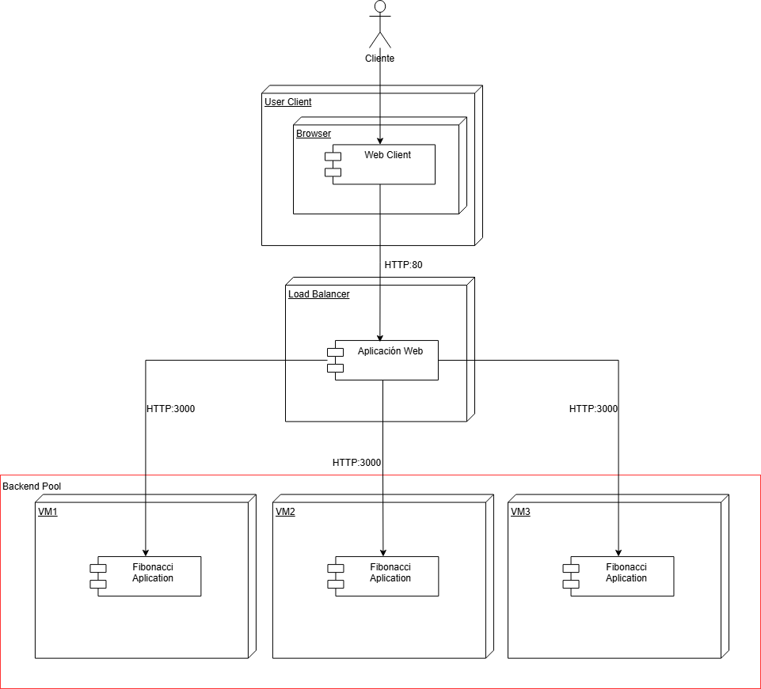

---

## Preguntas

- ¿Cuáles son los tipos de balanceadores de carga en Azure y en qué se diferencian?, ¿Qué es SKU, qué tipos hay y en qué se diferencian?, ¿Por qué el balanceador de carga necesita una IP pública?

El Public Load Balancer, que distribuye tráfico proveniente de Internet; el Internal Load Balancer, que opera exclusivamente dentro de una red virtual; y el Application Gateway, orientado a capa 7, con capacidades avanzadas como enrutamiento inteligente y protección mediante WAF.

Para los SKUs, la versión Standard proporciona mayor disponibilidad, redundancia por zonas y es la opción recomendada para entornos productivos.

- ¿Cuál es el propósito del _Backend Pool_?

El Backend Pool define el conjunto de máquinas virtuales que recibirán el tráfico distribuido por el balanceador. En esencia, agrupa y expone los recursos computacionales que atenderán las solicitudes del servicio.

- ¿Cuál es el propósito del _Health Probe_?

El Health Probe permite al balanceador verificar el estado operativo de cada instancia del backend. Si una máquina deja de responder adecuadamente, se marca como no saludable y se excluye temporalmente del enrutamiento de tráfico.

- ¿Cuál es el propósito de la _Load Balancing Rule_? ¿Qué tipos de sesión persistente existen, por qué esto es importante y cómo puede afectar la escalabilidad del sistema?.

La regla de balanceo describe cómo se distribuye el tráfico entrante: especifica puerto, protocolo y el backend destino. También define el manejo de afinidad de sesión, cuyo uso puede afectar la escalabilidad al mantener a un cliente ligado a una instancia específica.

- ¿Qué es una _Virtual Network_? ¿Qué es una _Subnet_? ¿Para qué sirven los _address space_ y _address range_?

Una Virtual Network (VNet) constituye el espacio de red privado dentro de Azure donde se alojan los recursos. Las Subnets dividen ese espacio en segmentos lógicos independientes, cada uno con su propio rango de direcciones. El address space define el rango global de la VNet, y el address range define el rango específico asignado a cada Subnet.

- ¿Qué son las _Availability Zone_ y por qué seleccionamos 3 diferentes zonas?. ¿Qué significa que una IP sea _zone-redundant_?

Las Availability Zones son ubicaciones físicas independientes dentro de una misma región de Azure, diseñadas para evitar interrupciones por fallos localizados. Los recursos zone-redundant se distribuyen automáticamente entre distintas zonas, asegurando continuidad de servicio incluso si una de ellas falla.

- ¿Cuál es el propósito del _Network Security Group_?

El Network Security Group actúa como un componente de seguridad que controla el tráfico de red permitido o denegado hacia máquinas virtuales o subnets, operando como un firewall distribuido a nivel de red.
